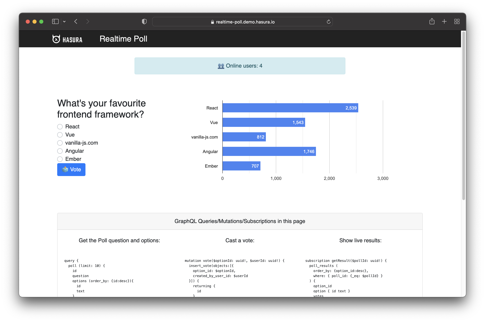

# Hasura GraphQL Application Over Postgres with React Frontend

This repository is for a proof of concept I built using React and is powered by Hasura GraphQL Engine over Postgres.  A voting application that displays the poll results in real-time. Each time someone votes, the application updates automatically and shows the new results.

Even though this is a full stack application, I did not have to write any backend code thanks to Hasura!



The application will use:

- Hasura GraphQL Engine for the backend
- React and Apollo for the frontend

## Why These Technologies?

Before going further, let's talk about the technologies we'll use for the application stack.

#### Hasura GraphQL Engine

Hasura is an open source GraphQL Engine that enables you to create an instant, real-time GraphQL API without writing backend code at all.

You might wonder how that works. Hasura connects to your database and it automatically generates the API based on your database tables and views. You get things like the GraphQL Schema and Resolvers out of the box.

Therefore, the reason for choosing Hasura is to speed up the process of building the real-time GraphQL API. Hasura does all the heavy lifting, so we can focus on other things.

#### React and Apollo Client

React is one of the most popular JavaScript frameworks with a great community. It's also versatile, allowing you to build both web and mobile applications.

Apollo Client is a fully-featured GraphQL client that allows you to build user interface components and fetch data via GraphQL seamlessly. The Apollo Client is also one of the most popular GraphQL clients.

Together, React and Apollo Client form a powerful combination that fits the requirements for the real-time voting application.

## Data Modeling

The database will contain the following tables:
- user – a user is a person who votes in the poll.
- poll – the poll represents the question (e.g. what is your favorite framework?)
- option – an option is a poll option that people can pick.
- vote – a vote is the link between a user and a poll option. It represents the user’s vote.
  


The figure above illustrates the database tables and relationships.

There is a one-to-many relationship between the user and vote. A user can vote multiple times, but one vote can belong to only one user.

The poll and option have a one-to-many relationship meaning that a poll can have multiple options, but an option belongs to only one poll.

Lastly, there is a one-to-many relationship between the option and vote tables. What that means is that you can only pick one option. One vote represents one option.

The database also has two views – online_users and poll_results. They show the number of online users and the results from the poll.

## Backend Implementation with Hasura

You can use Hasura in two ways:

- Locally with the help of Docker.
- In the cloud with the help of Hasura Cloud.
- It's worth mentioning that Hasura Cloud also offers advanced performance, security, and  monitoring features.
  
 Some of the things it offers are as follows:

- Automatically scaling your application up or down.
- Monitoring and tracing.
- Rate limiting.
- These are just three benefits, but there are more.

I chose to build this app using the cloud version for the obvious benefits.

### Code Used To Implement Apollo Client

```javascript
import { ApolloClient, HttpLink, InMemoryCache, split } from "@apollo/client";
import { GraphQLWsLink } from '@apollo/client/link/subscriptions';
import { createClient } from "graphql-ws";
import { getMainDefinition } from "@apollo/client/utilities";

const GRAPHQL_ENDPOINT = "realtime-poll.hasura.app";

const scheme = (proto) =>
  window.location.protocol === "https:" ? `${proto}s` : proto;

const wsURI = `${scheme("ws")}://${GRAPHQL_ENDPOINT}/v1/graphql`;
const httpURL = `${scheme("https")}://${GRAPHQL_ENDPOINT}/v1/graphql`;

const splitter = ({ query }) => {
  const { kind, operation } = getMainDefinition(query) || {};
  const isSubscription =
    kind === "OperationDefinition" && operation === "subscription";
  return isSubscription;
};

const cache = new InMemoryCache();
const options = { reconnect: true };

const wsLink = new GraphQLWsLink(createClient({ url: wsURI, connectionParams: { options } }));
const httpLink = new HttpLink({ uri: httpURL });
const link = split(splitter, wsLink, httpLink);
const client = new ApolloClient({ link, cache });

export default client;

```

### Code Used To Implement GraphQL Queries and Mutations

```javascript
import gql from "graphql-tag";
import React from "react";
import { Card } from "react-bootstrap";

const QUERY_GET_POLL = gql`
  query {
    poll(limit: 10) {
      id
      question
      options(order_by: { id: desc }) {
        id
        text
      }
    }
  }
`;

const MUTATION_VOTE = gql`
  mutation vote($optionId: uuid!, $userId: uuid!) {
    insert_vote(
      objects: [{ option_id: $optionId, created_by_user_id: $userId }]
    ) {
      returning {
        id
      }
    }
  }
`;

const SUBSCRIPTION_RESULT = gql`
  subscription getResult($pollId: uuid!) {
    poll_results(
      order_by: { option_id: desc }
      where: { poll_id: { _eq: $pollId } }
    ) {
      option_id
      option {
        id
        text
      }
      votes
    }
  }
`;

const SUBSCRIPTION_ONLINE_USERS = gql`
  subscription getOnlineUsersCount {
    online_users {
      count
    }
  }
`;

const MUTATION_MARK_USER_ONLINE = gql`
  mutation userOnline($uuid: uuid) {
    update_user(where: { id: { _eq: $uuid } }, _set: { online_ping: true }) {
      affected_rows
      returning {
        last_seen_at
      }
    }
  }
`;

const MUTATION_NEW_USER = gql`
  mutation newUser($uuid: uuid) {
    insert_user(objects: [{ id: $uuid }]) {
      returning {
        id
        created_at
      }
    }
  }
`;

const GraphQLQueryList = () => (
  <div className="container">
    <div className="col-md-12 cardGraphQL">
      <Card>
        <Card.Header>
          GraphQL Queries/Mutations/Subscriptions in this page
        </Card.Header>
        <Card.Body>
          <div className="row">
            <div className="col-md-4">
              Get the Poll question and options:
              <pre>{QUERY_GET_POLL.loc.source.body}</pre>
              Create a new user:
              <pre>{MUTATION_NEW_USER.loc.source.body}</pre>
            </div>
            <div className="col-md-4">
              Cast a vote:
              <pre>{MUTATION_VOTE.loc.source.body}</pre>
              Mark user online:
              <pre>{MUTATION_MARK_USER_ONLINE.loc.source.body}</pre>
            </div>
            <div className="col-md-4">
              Show live results:
              <pre>{SUBSCRIPTION_RESULT.loc.source.body}</pre>
              Get real-time number of users:
              <pre>{SUBSCRIPTION_ONLINE_USERS.loc.source.body}</pre>
            </div>
          </div>
        </Card.Body>
      </Card>
    </div>
  </div>
);

export {
  GraphQLQueryList,
  QUERY_GET_POLL,
  MUTATION_VOTE,
  SUBSCRIPTION_RESULT,
  SUBSCRIPTION_ONLINE_USERS,
  MUTATION_MARK_USER_ONLINE,
  MUTATION_NEW_USER,
};
```

### Code Used To Implement Poll Functionality

```javascript
import { useMutation, useQuery } from "@apollo/client";
import React, { useEffect, useState } from "react";
import { Button, Form } from "react-bootstrap";
import { Error, Loading } from "./Components";
import { MUTATION_VOTE, QUERY_GET_POLL } from "./GraphQL";
import { Result } from "./Result";

const PollQuestion = ({ poll, userId }) => {
    const defaultState = {
      optionId: "",
      pollId: poll.id,
      voteBtnText: "🗳 Vote",
      voteBtnStyle: "primary",
    };
    const [state, setState] = useState(defaultState);
    const [vote, { data, loading, error }] = useMutation(MUTATION_VOTE);

    const handleOptionChange = (e) => {
        const optionId = e.currentTarget.value;
        setState((prev) => ({ ...prev, optionId }));
    };

    const handlesubmitVote = (e) => {
        e.preventDefault();
        if (!state.optionId) {
          setState({
            voteBtnText: "✋ Select an option and try again",
            voteBtnStyle: "warning",
          });
          return;
        }
    
        setState({
          voteBtnText: "🗳️ Submitting",
          voteBtnStyle: "info",
        });
    
        vote({
          variables: {
            optionId: state.optionId,
            userId,
          },
        });
    };

    useEffect(() => {
        if (data) {
          setState({
            voteBtnText: "👍 Done",
            voteBtnStyle: "success",
          });
    
          //  Re-authorize to vote after 5 seconds
          let timer = setTimeout(() => {
            setState({
              voteBtnText: "🗳️ Vote",
              voteBtnStyle: "primary",
            });
          }, 5000);
    
          return () => clearTimeout(timer);
        }
    
        if (error) {
          setState({
            voteBtnText: "Error 😞 Try again",
            voteBtnStyle: "danger",
          });
        }
    }, [data, error]);

    return (
        <div className="textLeft">
          <h3>{poll.question}</h3>
          <Form
            className="pollForm textLeft"
            onSubmit={(e) => {
              handlesubmitVote(e);
            }}
          >
            {poll.options.map(({ id, text }) => (
              <Form.Check
                custom
                type="radio"
                name="voteCandidate"
                id={id}
                key={id}
                value={id}
                label={text}
                onChange={handleOptionChange}
              />
            ))}
            <Button
              className="voteBtn info"
              variant={state.voteBtnStyle}
              type="submit"
            >
              {state.voteBtnText}
            </Button>
          </Form>
        </div>
    );
};

export const Poll = ({ userId }) => {
    const { data, loading, error } = useQuery(QUERY_GET_POLL);
  
    if (loading) return <Loading />;
    if (error) return <Error message={error.message} />;
  
    return (
      <div className="container">
        {data?.poll.map((poll) => (
          <div key={poll.id} className="pollWrapper wd100">
            <div className="displayFlex">
              <div className="col-md-4 pollSlider">
                <PollQuestion poll={poll} userId={userId} />
              </div>
              <div className="col-md-8 pollresult">
                <Result pollId={poll.id} />
              </div>
            </div>
          </div>
        ))}
      </div>
    );
};
```

### Code Used To Display Results in Frontend

```javascript
import { useSubscription } from "@apollo/client";
import React from "react";
import { Chart } from "react-google-charts";
import { Error, Loading } from "./Components";
import { SUBSCRIPTION_RESULT } from "./GraphQL";

export const Result = ({ pollId }) => {
  const { data, loading, error } = useSubscription(SUBSCRIPTION_RESULT, {
    variables: { pollId },
  });

  const hasResults = data?.poll_results.length > 0;

  if (loading) return <Loading />;
  if (error) return <Error message={error.message} />;

  return (
    <div>
      {hasResults ? <PollChart data={data?.poll_results} /> : <p>No result</p>}
    </div>
  );
};

const PollChart = ({ data }) => {
  const COLOR = "color: #4285f4";
  const d = [
    ["Option", "No. of votes", { role: "annotation" }, { role: "style" }],
  ];

  data.forEach(({ option, votes }) =>
    d.push([option.text, parseInt(votes), parseInt(votes), COLOR])
  );

  return (
    <Chart
      className="poll-result-chart-container"
      chartType="BarChart"
      loader={<div>Loading Chart</div>}
      data={d}
      options={chartOptions}
    />
  );
};

const chartOptions = {
  height: "100%",
  chart: {
    title: "Realtime results",
  },
  legend: { position: "none" },
  animation: {
    duration: 1000,
    easing: "out",
    startup: true,
  },
};
```

## Getting Started with Create React App

This project was bootstrapped with [Create React App](https://github.com/facebook/create-react-app).

## Available Scripts

In the project directory, you can run:

### `npm start`

Runs the app in the development mode.\
Open [http://localhost:3000](http://localhost:3000) to view it in your browser.

The page will reload when you make changes.\
You may also see any lint errors in the console.

### `npm test`

Launches the test runner in the interactive watch mode.\
See the section about [running tests](https://facebook.github.io/create-react-app/docs/running-tests) for more information.

### `npm run build`

Builds the app for production to the `build` folder.\
It correctly bundles React in production mode and optimizes the build for the best performance.

The build is minified and the filenames include the hashes.\
Your app is ready to be deployed!

See the section about [deployment](https://facebook.github.io/create-react-app/docs/deployment) for more information.

### `npm run eject`

**Note: this is a one-way operation. Once you `eject`, you can't go back!**

If you aren't satisfied with the build tool and configuration choices, you can `eject` at any time. This command will remove the single build dependency from your project.

Instead, it will copy all the configuration files and the transitive dependencies (webpack, Babel, ESLint, etc) right into your project so you have full control over them. All of the commands except `eject` will still work, but they will point to the copied scripts so you can tweak them. At this point you're on your own.

You don't have to ever use `eject`. The curated feature set is suitable for small and middle deployments, and you shouldn't feel obligated to use this feature. However we understand that this tool wouldn't be useful if you couldn't customize it when you are ready for it.

## Learn More

You can learn more in the [Create React App documentation](https://facebook.github.io/create-react-app/docs/getting-started).

To learn React, check out the [React documentation](https://reactjs.org/).

### Code Splitting

This section has moved here: [https://facebook.github.io/create-react-app/docs/code-splitting](https://facebook.github.io/create-react-app/docs/code-splitting)

### Analyzing the Bundle Size

This section has moved here: [https://facebook.github.io/create-react-app/docs/analyzing-the-bundle-size](https://facebook.github.io/create-react-app/docs/analyzing-the-bundle-size)

### Making a Progressive Web App

This section has moved here: [https://facebook.github.io/create-react-app/docs/making-a-progressive-web-app](https://facebook.github.io/create-react-app/docs/making-a-progressive-web-app)

### Advanced Configuration

This section has moved here: [https://facebook.github.io/create-react-app/docs/advanced-configuration](https://facebook.github.io/create-react-app/docs/advanced-configuration)

### Deployment

This section has moved here: [https://facebook.github.io/create-react-app/docs/deployment](https://facebook.github.io/create-react-app/docs/deployment)

### `npm run build` fails to minify

This section has moved here: [https://facebook.github.io/create-react-app/docs/troubleshooting#npm-run-build-fails-to-minify](https://facebook.github.io/create-react-app/docs/troubleshooting#npm-run-build-fails-to-minify)
